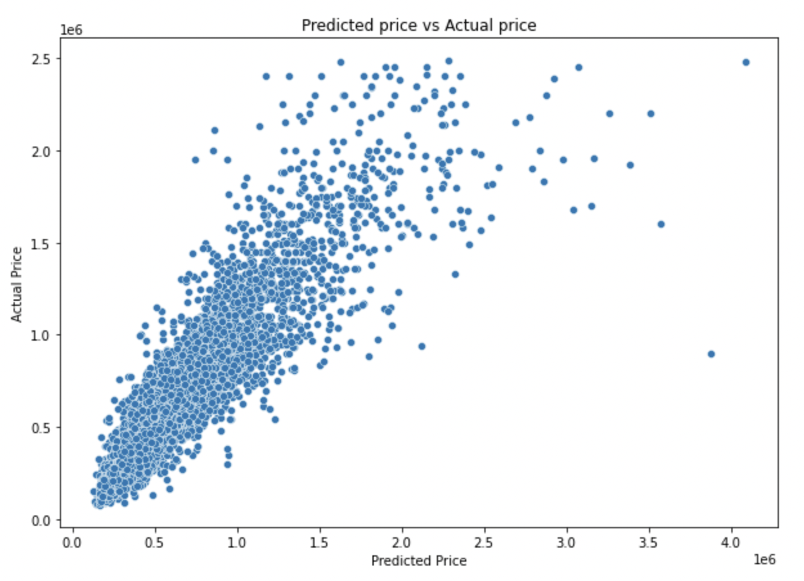
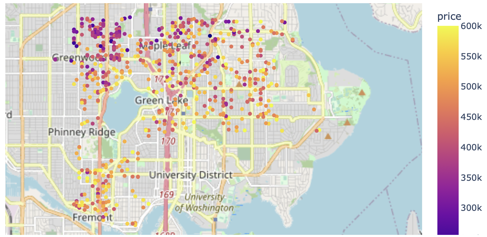

# Housing-Data-Linear-Regression

## Business Problem
This prorject linear regression analysis using existing housing data of King Country, Washington from Kaggle. The data is for the 2014-2015 years, the main goal of this project to create a predictive model to help the stakeholders, a young family of tree is looking to buy a starter family house in Seattle in specific neighborhoods in mind. They are looking for a two bedroom home, with a budget of 600000 USD and they wouldn't mind to get a fixer-upper home. The goes of this project to build a predictive model and help the family with suggestions in which zipcodes they should be looking for a house. 

## Data
The King County housing data contains information about the sales prices for 2014 -2015. The source file has 21597 observations and 21 columns, including price as the target variable.
The original data set had 6 object datatypes, and the rest of them were integer and float categories.
There were missing values in the following three columns: waterfront, view and yr_built.
I assumed that all the missing values for waterfront means that they are not waterfront properties and I replaced the missing values with 'NO'. Same for view, if the value is missing, I assumed they have no view and for year renovated if the year were missing, I assumed they were not renovated at all and replaced them with 'NO'. 
The sqft_basement column also had 454 rows with '?', I replaced this with 0. I made a new column has_basement where I put 1 for all lines where the sqft were greater then 0 and zeros for the ones where there were no basement.
I also changed the conditon column to ordinal values,from 1 to 5. 

The grade had a string value started with a numerical character, so I split this up and only kept the numerical value.
I also replaced the yes and no values to 1 and 0 for the following columns: waterfront.

I change the datatype on the following columns:
- date - datetime
- floors - integer
- grade - category
- condition - category
- waterfront - category
- view - category
- has_basement - category
- renovated - category
- month - category
- year - category
- zipcode - category

Created new columns:
- has_basement
- renovated
- month (from date)
- year (from date)

## Modeling
I did a 70 - 30% train -test split after the baseline model. The target variable is the price and all the other variables as predictors. I craeted 5 linear regression models and selected the best one comparing to the baseline model. I used one-hot encoder for the zipcodes. 

## Regression results
### Baseline Model
My baseline model contained all the numberic columns:
- price, bedrooms, bathrooms, sqft_living, sqft_lot, floors, sqft_above, sqft_basement, yr_built, sqft_living15, sqft_lot15
After standardizing the numerical columns I used stats models on the first baseline model.

R2: 0.569
This model is explaining about 57 % of the variance in price.

### Selected Model (Model 3)
In this model I checked for highly correlated features and droped sqft_above and sqft_living15. This model already incudes the hot_encoded zipcodes as well. The original data had been standardized and the target 
The results are the following for the r squared, mean absolute error and the root mean squared error

R2 test: 0.8668
MAE: 73588 USD
RMSE: 358 USD

The model captures 86.68 % of the variation in price. 
On average the model is off by 73588 USD.

## Recomendations
Based on the analysis and the stakeholders expectations the family should consider the following 2 locations for buying a house:
- 98103
- 98115

Based on the seasonality in the dataset, the best time for them to buy a house is between March and October. 

The average hous price on these zipcodes are:
- 98103: 585048 +/- 73488 USD
- 98115: 619944 +/- 73488 USD

## Next Steps
If I had more time I would have tried to get some more data about the neighborhood. In general how safe is the recommended area. How close are parks, schools and restaurants. I would also try to point out the distance to the closest public transport stops (e.g.: subway stations).

